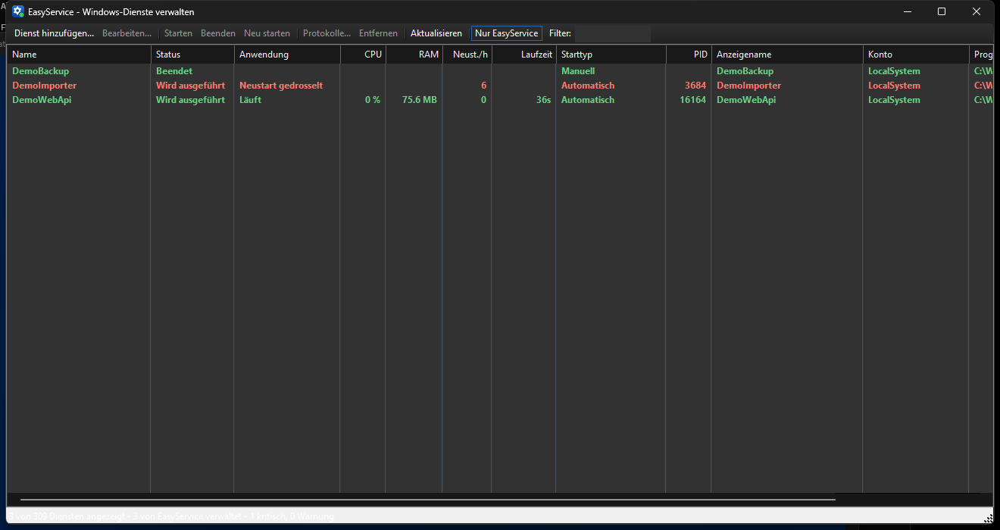
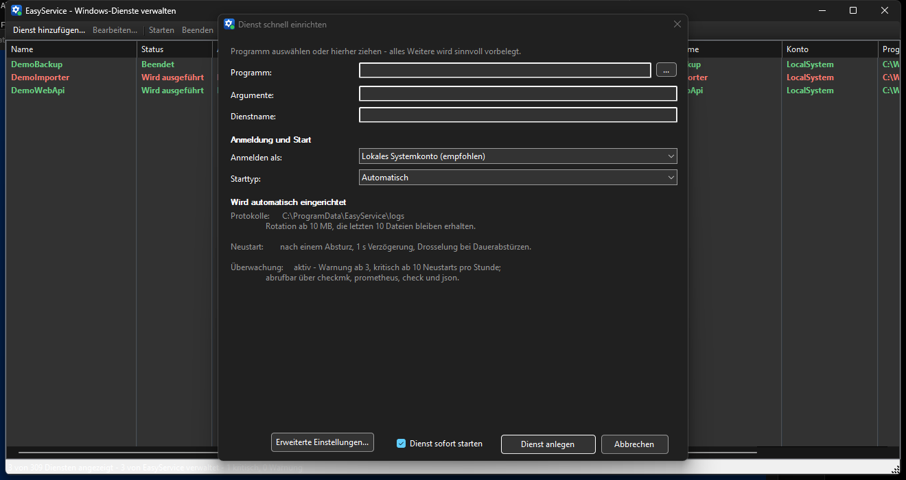

# EasyService

**Windows-Dienste per Mausklick anlegen, überwachen und protokollieren.**

EasyService macht aus jeder beliebigen `.exe`, `.bat` oder `.cmd` einen vollwertigen
Windows-Dienst – ohne `sc.exe`-Kommandozeilen, ohne Registry-Gefrickel und ohne dass die
Anwendung selbst etwas von Windows-Diensten wissen muss.

Es ist eine Alternative zu [NSSM](https://nssm.cc/) mit demselben Grundprinzip
(ein Wrapper-Prozess beaufsichtigt die eigentliche Anwendung), aber vollständig
GUI-gesteuert, auf Deutsch und mit einem eingebauten Live-Protokoll-Viewer.

[](https://github.com/sdrabent/easyservice/actions/workflows/build.yml)
[](LICENSE)



*Drei überwachte Dienste: einer läuft sauber, einer startet im Dauerlauf neu und wird
rot markiert, einer ist bewusst gestoppt. Windows selbst würde für die ersten beiden
gleichermaßen „Wird ausgeführt" melden.*

---

## Warum EasyService?

| | `sc.exe` | NSSM | **EasyService** |
|---|---|---|---|
| Beliebige Programme als Dienst | ✗ | ✓ | ✓ |
| Grafische Oberfläche | ✗ | teilweise | **✓ vollständig** |
| **Schnelleinrichtung mit Vorbelegung** | ✗ | ✗ | **✓** |
| Dark Mode | ✗ | ✗ | ✓ |
| stdout/stderr in Dateien | ✗ | ✓ | ✓ |
| Automatische Log-Rotation | ✗ | ✓ | ✓ |
| **Live-Protokollansicht integriert** | ✗ | ✗ | **✓** |
| Neustart-Richtlinie pro Exit-Code | ✗ | ✓ | ✓ |
| Gestufter, sauberer Shutdown | ✗ | ✓ | ✓ |
| Prozessbaum sicher beenden | ✗ | ✓ | ✓ |
| Einzelne .exe, keine Installation | ✓ | ✓ | ✓ |
| **Monitoring-Anbindung** | ✗ | ✗ | **✓ Checkmk, Prometheus, Zabbix, Nagios** |
| **Flapping-Erkennung** | ✗ | ✗ | **✓** |
| Open Source | ✗ | ✓ (Public Domain) | ✓ (MIT) |

## Download

Fertige Binärdateien gibt es unter **[Releases](../../releases)**:

| Datei | Beschreibung |
|---|---|
| `easyservice.exe` | Alles enthalten, läuft sofort. Keine Installation nötig. |
| `easyservice-framework-dependent.exe` | Nur ~300 KB, benötigt das [.NET 9 Desktop Runtime](https://dotnet.microsoft.com/download/dotnet/9.0). |

Die Datei irgendwohin legen (z. B. `C:\Tools\easyservice.exe`) und per Doppelklick starten.

> **Wichtig:** Der Pfad zur `easyservice.exe` wird im Dienst hinterlegt. Wird die Datei später
> verschoben, starten die damit angelegten Dienste nicht mehr. Am besten gleich einen festen
> Ort wählen, etwa `C:\Program Files\EasyService\`.

Voraussetzungen: Windows 10 / Server 2016 oder neuer, x64, Administratorrechte
(Dienste zu verwalten geht unter Windows grundsätzlich nur erhöht – EasyService fordert
die Rechte beim Start per UAC an).

## Schnellstart

1. `easyservice.exe` starten und die UAC-Abfrage bestätigen.
2. **Dienst hinzufügen…** anklicken – oder die `.exe` einfach ins Fenster ziehen.
3. Programm auswählen. Dienstname, Startverzeichnis, Protokollpfade, Rotation,
   Neustart-Richtlinie und Überwachungsschwellen werden vorbelegt und angezeigt.
4. **Dienst anlegen** – fertig.



Das ist die *Fast Lane*: vier Felder statt neun Registerkarten. Sie deckt den Normalfall
ab und zeigt darunter, was sie automatisch eingerichtet hat, statt es zu erfragen.
Das Dienstkonto wird für den nächsten Dienst gemerkt; das Kennwort bleibt dabei
standardmäßig nur im Speicher der laufenden Sitzung.

Wer mehr braucht, kommt über **Erweiterte Einstellungen…** in den vollständigen Editor
mit neun Registerkarten. Schlägt der erste Start fehl, bietet EasyService direkt das
Protokoll an – die Ursache ist fast immer ein falscher Pfad oder ein falsches Argument.

Für Skripte:

```cmd
easyservice install MeinDaemon "C:\apps\daemon.exe" --config C:\apps\daemon.yml
```

## Funktionen im Detail

Der Dienst-Editor ist wie das Eigenschaftenfenster von NSSM in Registerkarten aufgeteilt:

**Anwendung** — Programm, Startverzeichnis und Argumente.

**Details** — Anzeigename, Beschreibung, Starttyp (automatisch / verzögert / manuell /
deaktiviert), Prozesspriorität, Prozessor-Affinität und eine optionale Startverzögerung.

**Anmelden** — lokales Systemkonto, lokaler Dienst, Netzwerkdienst oder ein Benutzerkonto.
Bei einem Benutzerkonto vergibt EasyService automatisch das Recht *Als Dienst anmelden*
(`SeServiceLogonRight`), das sonst per `secpol.msc` von Hand gesetzt werden müsste.

**Abhängigkeiten** — andere Dienste, die vorher laufen müssen, per Auswahlliste.

**Umgebung** — zusätzliche Umgebungsvariablen (`NAME=WERT`), wahlweise ergänzend oder
als vollständiger Ersatz der Systemumgebung.

**Protokollierung** — getrennte oder gemeinsame Dateien für stdout und stderr, anhängen
oder überschreiben, optionale Zeitstempel pro Zeile, Rotation nach Größe und/oder Zeit
und eine begrenzte Zahl aufbewahrter Archive.

**Beenden-Aktionen** — was passieren soll, wenn sich die Anwendung selbst beendet:
neu starten, ignorieren oder den Dienst beenden – wahlweise abhängig vom konkreten
Exit-Code. Ein Throttle-Fenster verhindert Neustartschleifen: Beendet sich die Anwendung
schneller als eingestellt, verdoppelt EasyService die Wartezeit bis maximal 60 Sekunden.

**Herunterfahren** — der gestufte Shutdown. Jede Stufe ist einzeln abschaltbar und hat
ein eigenes Zeitlimit:

1. `Strg+C` an die Konsole der Anwendung (für Konsolenprogramme)
2. `WM_CLOSE` an alle Fenster der Anwendung
3. `WM_QUIT` an alle Threads der Anwendung
4. Harter Abbruch – wahlweise samt aller Kindprozesse

### Live-Protokollansicht

Der eingebaute Viewer hängt sich an die laufende Protokolldatei (`FileShare.ReadWrite`),
zeigt neue Zeilen automatisch an, folgt der Rotation, bietet die archivierten Dateien zur
Auswahl an und kann nach Text filtern. Eine zweite Registerkarte zeigt die Ereignisse, die
EasyService selbst ins Windows-Anwendungsprotokoll geschrieben hat – Start, Absturz,
Neustart, Exit-Codes.

### Monitoring

Der Windows-Dienst-Manager kennt nur eine Frage: läuft der Dienstprozess? Bei einem
Wrapper ist der Dienstprozess aber EasyService selbst — die eigentliche Anwendung kann
dahinter im Minutentakt abstürzen, und `sc query` meldet weiter fröhlich `RUNNING`.

EasyService misst deshalb selbst: Neustarts pro Stunde, Laufzeit, CPU und Speicher des
gesamten Prozessbaums, letzter Exit-Code — und gibt das in den Formaten aus, die die
gängigen Systeme direkt lesen:

```cmd
easyservice checkmk       :: Local Check, eine Zeile je Dienst, mit Perfdaten
easyservice prometheus    :: Exposition-Format, auch als --output für node_exporter
easyservice check <Name>  :: Nagios/Icinga-Plugin mit Exit-Code 0/1/2/3
easyservice json          :: alles, für Zabbix und eigene Skripte
```

Zusätzlich landet jedes Ereignis mit einer **stabilen Ereignis-ID** im
Windows-Anwendungsprotokoll (1004 = Neustart gedrosselt, 1005 = Start fehlgeschlagen,
1008 = hart beendet), sodass sich ohne Textmustersuche alarmieren lässt.

Alle Einzelheiten samt fertiger Konfigurationsschnipsel: **[docs/monitoring.md](docs/monitoring.md)**.

### Sicherheitsnetz beim Löschen

Dienste, die *nicht* mit EasyService angelegt wurden, lassen sich nicht bearbeiten und nur
nach einer zusätzlichen Bestätigung entfernen, bei der der Dienstname abgetippt werden muss.
Damit kann ein Fehlklick keinen Systemdienst zerstören.

## Kommandozeile

Die GUI ist der Hauptweg, für Deployment-Skripte und CI gibt es dieselben Funktionen auch
ohne Oberfläche:

```
easyservice list
easyservice install <Name> <Programm> [Argumente...]
easyservice remove <Name>
easyservice start|stop|restart|status <Name>
easyservice gui [Name]
```

Beispiel:

```cmd
easyservice install MeinDaemon "C:\apps\daemon.exe" --config C:\apps\daemon.yml
easyservice status MeinDaemon
```

`status` liefert Exit-Code 0, wenn der Dienst läuft, und 3, wenn nicht – praktisch für
Monitoring-Skripte.

## Wie es funktioniert

`easyservice.exe` ist bewusst eine einzige Datei mit zwei Betriebsarten – genau wie
`nssm.exe`:

```
Doppelklick                      Dienst-Manager (SCM)
      │                                    │
      ▼                                    ▼
easyservice.exe            easyservice.exe run "MeinDienst"
      │                                    │
   GUI-Modus                        Supervisor-Modus
   (MainForm)                              │
                              ┌────────────┴────────────┐
                              │                         │
                      Konfiguration aus         CreateProcess mit
                      der Registry lesen        umgeleiteten Pipes
                                                         │
                                          ┌──────────────┼──────────────┐
                                          ▼              ▼              ▼
                                       stdout         stderr      Job-Objekt
                                          │              │      (Prozessbaum)
                                          ▼              ▼
                                    rotierende Protokolldateien
```

Beim Anlegen eines Dienstes trägt EasyService sich selbst als Dienstprogramm ein
(`"C:\Tools\easyservice.exe" run "MeinDienst"`) und legt die Konfiguration unter
`HKLM\SYSTEM\CurrentControlSet\Services\<Name>\Parameters` ab. Startet Windows den Dienst,
läuft dieselbe `.exe` im Supervisor-Modus, liest die Konfiguration, startet die eigentliche
Anwendung und beaufsichtigt sie.

Die Anwendung landet in einem Windows-Job-Objekt. Dadurch lassen sich beim Beenden
zuverlässig auch alle Kindprozesse mitnehmen – der klassische Fall, in dem ein per
`sc.exe` angelegter Dienst verwaiste Prozesse hinterlässt.

Zusätzlich werden die Windows-eigenen Wiederherstellungsaktionen des Dienstes gesetzt.
Sie greifen als zweites Sicherheitsnetz, falls der Supervisor-Prozess selbst ausfällt.

### Registry-Referenz

Alle Werte liegen unter `HKLM\SYSTEM\CurrentControlSet\Services\<Name>\Parameters` und
sind mit `regedit` einseh- und skriptbar:

| Wert | Typ | Bedeutung |
|---|---|---|
| `Application` | EXPAND_SZ | Pfad zum Programm |
| `AppDirectory` | EXPAND_SZ | Startverzeichnis |
| `AppParameters` | EXPAND_SZ | Argumente |
| `AppPriority` | DWORD | 0 = Echtzeit … 5 = Niedrig |
| `AppAffinity` | QWORD | Prozessormaske, 0 = alle |
| `AppStartupDelay` | DWORD | Verzögerung vor dem ersten Start (ms) |
| `AppEnvironmentExtra` | MULTI_SZ | Zusätzliche Variablen `NAME=WERT` |
| `AppEnvironmentReplace` | DWORD | 1 = Systemumgebung ersetzen |
| `AppStdout` / `AppStderr` | EXPAND_SZ | Protokolldateien |
| `AppAppendOutput` | DWORD | 1 = anhängen, 0 = beim Start leeren |
| `AppTimestampLog` | DWORD | 1 = Zeitstempel je Zeile |
| `AppRotateFiles` | DWORD | 1 = Rotation aktiv |
| `AppRotateBytes` | QWORD | Rotationsgröße in Bytes |
| `AppRotateSeconds` | DWORD | Rotationsintervall, 0 = nur nach Größe |
| `AppRotateKeep` | DWORD | Anzahl Archive, 0 = unbegrenzt |
| `AppExitDefault` | DWORD | 0 = Neustart, 1 = Ignorieren, 2 = Dienst beenden |
| `AppExit\<Code>` | DWORD | Aktion für einen bestimmten Exit-Code |
| `AppRestartDelay` | DWORD | Wartezeit vor dem Neustart (ms) |
| `AppThrottle` | DWORD | Throttle-Fenster (ms) |
| `AppStopUseConsole` / `…Window` / `…Threads` | DWORD | Shutdown-Stufen aktiv |
| `AppStopConsoleDelay` / `…WindowDelay` / `…ThreadsDelay` | DWORD | Zeitlimit je Stufe (ms) |
| `AppStopUseTerminate` | DWORD | 1 = notfalls hart beenden |
| `AppKillProcessTree` | DWORD | 1 = Kindprozesse mitbeenden |
| `AppLogServiceEvents` | DWORD | 1 = eigenes Diagnoseprotokoll schreiben |

Standardmäßig liegen die Protokolle unter `%ProgramData%\EasyService\logs\`.

## Aus dem Quellcode bauen

Benötigt wird das [.NET 9 SDK](https://dotnet.microsoft.com/download/dotnet/9.0) (oder neuer)
auf einem Windows-Rechner.

```cmd
git clone https://github.com/sdrabent/easyservice.git
cd easyservice
dotnet build EasyService.sln -c Release
```

Einzeldatei erzeugen:

```cmd
dotnet publish src/EasyService/EasyService.csproj -c Release -r win-x64 ^
  --self-contained true -p:PublishSingleFile=true ^
  -p:EnableCompressionInSingleFile=true -p:IncludeNativeLibrariesForSelfExtract=true ^
  -o publish
```

Das Projekt kommt ohne NuGet-Abhängigkeiten aus; alle Windows-Aufrufe laufen direkt über
P/Invoke (`advapi32`, `kernel32`, `user32`).

### Tests

```cmd
dotnet run --project tests/EasyService.Tests -c Release
```

Die Tests steuern den Supervisor direkt an und brauchen weder Administratorrechte noch
einen installierten Dienst. Geprüft werden Ausgabeumleitung, Neustart-Richtlinie,
Exit-Code-Aktionen, Rotation samt Archivbegrenzung, das Beenden laufender Anwendungen,
Zeitstempel, Umgebungsvariablen, das Lesen der Dienstliste, der Aufbau aller Dialoge
sowie die komplette Monitoring-Kette bis hin zum Ausgabeformat für Checkmk und Prometheus.

```
  Ausgabe von stdout und stderr wird protokolliert          OK
  Beendete Anwendung wird neu gestartet                     OK
  Exit-Code-Aktion beendet den Dienst                       OK
  Aktion "Nichts tun" startet nicht neu                     OK
  Protokolle werden rotiert und Archive begrenzt            OK
  Stoppen beendet die laufende Anwendung                    OK
  Zeitstempel werden pro Zeile ergänzt                      OK
  Umgebungsvariablen erreichen die Anwendung                OK
  Dienstliste kann gelesen werden                           OK
  GUI-Dialoge lassen sich aufbauen                          OK
```

## Fehlersuche

**Der Dienst startet nicht und beendet sich sofort.**
Die erste Anlaufstelle ist das EasyService-Protokoll des Dienstes
(`…-easyservice.log`, erreichbar über **Protokolle…** → Auswahlliste). Dort steht, ob
das Programm gefunden wurde, mit welchem Code es sich beendet hat und welche Aktion
gegriffen hat. Parallel landen dieselben Meldungen im Windows-Anwendungsprotokoll
unter der Quelle `EasyService`.

**Der Dienst läuft, aber die Anwendung tut nichts.**
Meist stimmt das Startverzeichnis nicht. Viele Programme suchen Konfigurationsdateien
relativ zum aktuellen Verzeichnis; ohne Angabe verwendet EasyService den Ordner des
Programms.

**Nach dem Beenden bleiben Prozesse übrig.**
*Auch alle Kindprozesse beenden* auf der Registerkarte *Herunterfahren* aktivieren.

**Die Anwendung wird dauernd neu gestartet.**
Beendet sie sich absichtlich mit Code 0, dann unter *Beenden-Aktionen* eine Regel
`Exit-Code 0 → Dienst beenden` anlegen.

**Ein Dienst lässt sich nicht anlegen: „ist zum Löschen vorgemerkt".**
Windows hält den Dienstschlüssel noch, solange irgendwo ein Handle offen ist – typisch
bei geöffnetem `services.msc`. Das Fenster schließen oder neu starten.

## Mitmachen

Fehlerberichte und Pull Requests sind willkommen. Für größere Änderungen bitte vorher ein
Issue anlegen, damit die Richtung geklärt ist. `dotnet build` muss warnungsfrei
durchlaufen und die Tests müssen grün sein.

## Lizenz

MIT – siehe [LICENSE](LICENSE).

---

## English summary

**EasyService** turns any executable into a proper Windows service, entirely through a GUI.
It is an open-source alternative to NSSM: one self-contained `easyservice.exe` that acts as
the graphical service manager when you double-click it, and as a process supervisor when the
Service Control Manager starts it.

Features: install/edit/remove services, stdout and stderr redirected to rotating log files,
a built-in live log viewer that follows rotation, per-exit-code restart policies with
back-off throttling, a staged graceful shutdown (Ctrl-C → `WM_CLOSE` → `WM_QUIT` →
terminate), job-object based process-tree cleanup, service accounts with automatic
`SeServiceLogonRight` assignment, dependencies, environment variables, priority and CPU
affinity — plus a command line for scripted deployments.

The user interface and log messages are in German. No NuGet dependencies; everything talks
to Windows directly through P/Invoke. Licensed under MIT.
