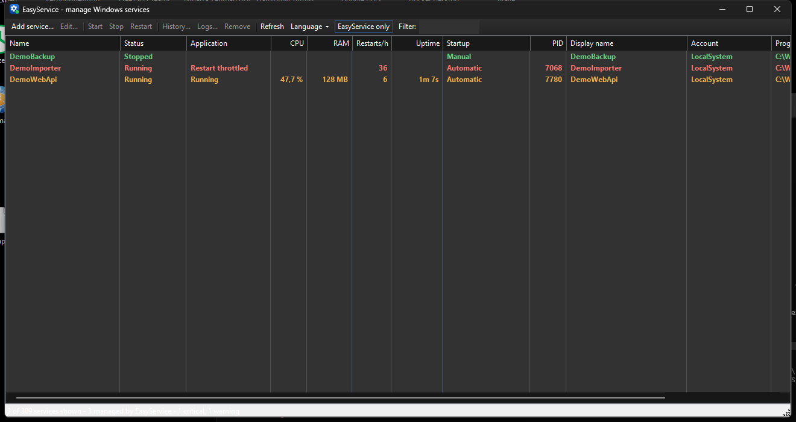
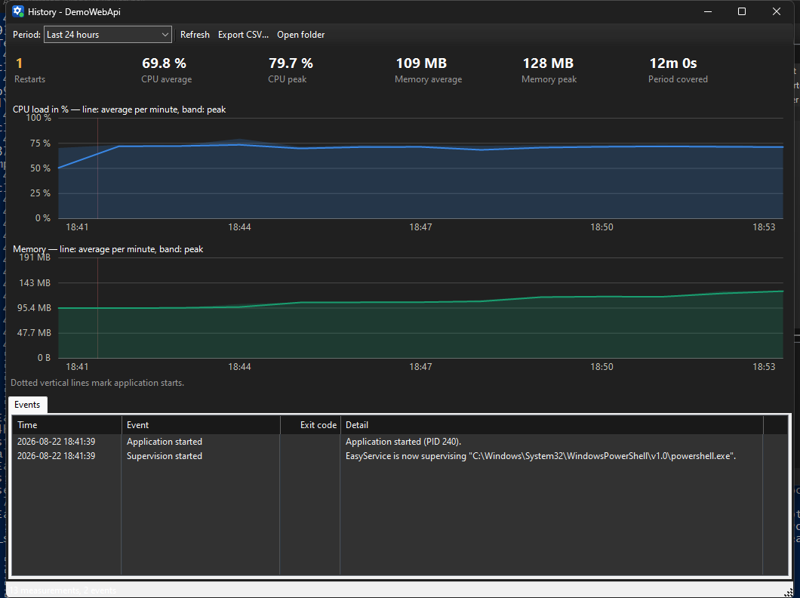
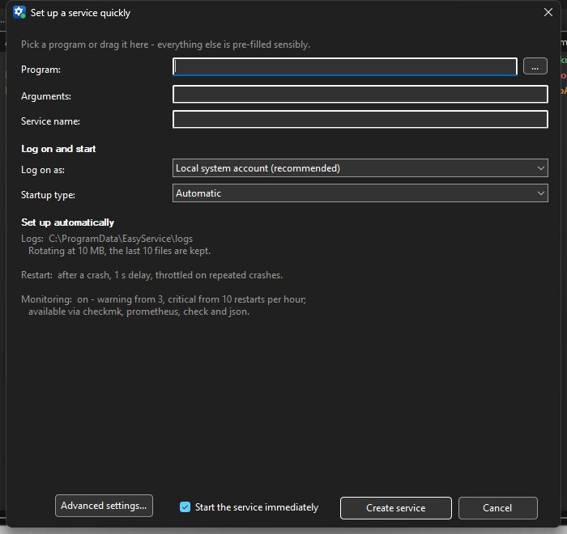

# EasyService

Runs any program as a Windows service, captures its output to rotating log files, and
reports what it is doing to Checkmk, Prometheus, Zabbix or Nagios.

It works the same way NSSM does: a supervisor process sits between the Service Control
Manager and your application. The difference is that the supervisor keeps records —
restart counts, CPU and memory of the process tree, exit codes — and hands them to
whatever monitoring you already run.

[](https://github.com/sdrabent/easyservice/actions/workflows/build.yml)
[](LICENSE)

**Deutsch:** [README.de.md](README.de.md)

## Status

This is a young project. What that means concretely:

* The supervisor, the monitoring output and the configuration format have automated
  tests, and the install/start/stop/remove path has been verified end to end against a
  real Service Control Manager.
* It has been run on Windows 11 and in CI on `windows-latest`. Nobody has run it on
  Server 2016, 2019 or 2022 yet, as far as I know.
* The binaries are not code-signed, so SmartScreen warns on first download. See
  [Limitations](#limitations).
* The French, Spanish and Italian translations have not been reviewed by native speakers.

If you try it somewhere and it breaks, an issue with the service's `…-easyservice.log`
attached is genuinely useful.

## What it does

| | |
|---|---|
| Service management | Create, edit, start, stop and remove services from a GUI or the command line |
| Output capture | stdout and stderr to files, separate or merged, with size- and time-based rotation and a capped number of archives |
| Log viewer | Attaches to the live file, follows rotation, filters by text, shows the matching Windows event log entries |
| Restart policy | Per exit code, with an exponential back-off that stops restart loops |
| Shutdown | Ctrl+C, then `WM_CLOSE`, then `WM_QUIT`, then terminate; each stage optional with its own timeout |
| Process tree | Children run inside a job object, so they are terminated with the service and counted in its resource usage |
| Monitoring | Checkmk, Prometheus, Nagios/Icinga and Zabbix output, plus stable event IDs |
| History | Per-minute CPU, memory and restart records, kept as CSV |
| Configuration as a file | JSON export and import, in the window or on the command line, for rolling the same definition out to many machines |
| Languages | English, German, French, Spanish, Italian |



## Monitoring

A wrapper hides the thing you want to know. `sc query` reports the state of the
supervisor process, not of the application behind it, so a service whose application
crashes and restarts every minute still shows up as `RUNNING`.

EasyService counts those restarts and reports them. Put one line in the Checkmk agent's
`local` directory:

```bat
@"C:\Program Files\EasyService\easyservice.exe" checkmk
```

and each supervised service becomes a Checkmk service. Actual output from a test machine,
with one healthy service and one that could not reach its database:

```
0 EasyService_DemoWebApi   uptime=1070s|restarts_1h=0;3;10;0|cpu=7.41%;;;0;100|mem=75345920B|procs=2   Running for 17m 50s, PID 5868, 2 processes, CPU 7.41 %, RAM 71.9 MB, 0 restarts/h
2 EasyService_DemoImporter uptime=0s|restarts_1h=36;3;10;0|cpu=0%;;;0;100|mem=0B|procs=0               The application keeps restarting and is being throttled. 36 restarts in the last hour, last exit code 3.
```

Other systems get the same data in their own format:

```
easyservice prometheus --output C:\...\easyservice.prom   textfile collector, replaced atomically
easyservice check <name>                                  Nagios/Icinga plugin, exit code 0/1/2/3
easyservice zabbix-discovery                              low-level discovery
easyservice json                                          everything, for your own scripts
```

Message text is a poor thing to alert on, so every event also carries a stable ID in the
Windows application log: 1004 when restarts are being throttled, 1005 when a start failed,
1008 when the application had to be terminated. Those IDs are part of the format and are
not translated.

```powershell
Get-WinEvent -FilterHashtable @{ LogName='Application'; ProviderName='EasyService'; Id=1004,1005,1008 }
```

Configuration snippets for each system are in [docs/monitoring.md](docs/monitoring.md),
including the `mk_logwatch` setup for feeding your application's stderr into Checkmk.

## History

Double-clicking a service shows what it has been doing rather than what it is doing right
now. The supervisor condenses its 5-second samples into one row per minute and keeps them
as CSV under `%ProgramData%\EasyService\history\` — about 80 KB per service and day, or
2.3 MB for the 30 days kept by default.



CPU and memory are drawn in separate charts because they are separate scales; two y-axes
in one frame produce a picture that looks informative and reads wrong. The line is the
per-minute average and the band the peak, which keeps a service that idles at 2 % and
spikes to 90 % distinguishable from one sitting at 40 %. Dotted verticals mark application
starts.

The screenshot above is a demo service running a synthetic load cycle for half an hour and
recycling itself every five minutes.

## Setting up a service



Pick a program, or drop an `.exe` onto the window. Service name, startup directory, log
paths, rotation, restart policy and monitoring thresholds get filled in and shown; the
account and password fields only appear if you switch away from the local system account.
The full editor with all nine tabs is behind **Advanced settings…**.

When the first start fails, EasyService offers the log straight away. In practice the
cause is a wrong path or a wrong argument, and the log says which.

From a script:

```cmd
easyservice install MyDaemon "C:\apps\daemon.exe" --config C:\apps\daemon.yml
easyservice status MyDaemon
```

`status` exits with 0 when the service is running and 3 when it is not.

## Rolling out to many machines

A complete definition — including exit-code rules, thresholds, environment variables and
the shutdown stages — can be written to a file and applied elsewhere:

```cmd
easyservice export MyDaemon --output daemon.json
easyservice import daemon.json
```

```powershell
# same definition on every server
$servers | ForEach-Object {
    Copy-Item daemon.json "\\$_\C$\temp\"
    Invoke-Command -ComputerName $_ { easyservice import C:\temp\daemon.json }
}

# what drifted?
easyservice export MyDaemon | git diff --no-index golden.json -
```

Two things about the format. Passwords are not written to the file, since a file that
ends up in a repository must not carry a service credential; on import the password is
read from `EASYSERVICE_PASSWORD`, which keeps it out of the process list where a command
line argument would be visible. Updating an existing service without that variable leaves
the stored password alone. Enum values are written as text (`"startup": "AutomaticDelayed"`)
so that a diff against a reference file can be read.

`export --all` writes every managed service into one file, and `import` accepts both
shapes.

The same three actions sit under **Configuration** in the window's toolbar, which is
usually where the first file comes from: set a service up by hand, export it, put it in
the repository, roll it out from the command line. On import the window asks for the
password of a service account instead of reading the environment variable.

## Install

Binaries are on the [releases page](../../releases).

| File | |
|---|---|
| `easyservice.exe` | Self-contained, about 63 MB, no runtime needed |
| `easyservice-framework-dependent.exe` | About 300 KB, needs the [.NET 9 Desktop Runtime](https://dotnet.microsoft.com/download/dotnet/9.0) |

The path to the executable is stored in every service you create, so pick a permanent
location before creating anything. `C:\Program Files\EasyService\` is a reasonable choice
and has the useful property that ordinary users cannot write to it — the service runs as
SYSTEM, so a writable location would be a privilege escalation waiting to happen.

Requirements: Windows 10 or Server 2016 and newer, x64, administrator rights. Managing
services always requires elevation; EasyService asks for it via UAC at start.

## Limitations

* **Not code-signed.** SmartScreen warns on first download, and AppLocker or WDAC will
  block it outright. Checksums are published with each release. Signing is planned but
  needs an organisation-level certificate.
* **No installer.** You copy the exe somewhere and run it. No MSI, no winget package yet.
* **x64 only.** No ARM64 build.
* **Interacting with the desktop does not really work.** The option exists because the
  service API has it, but Windows isolates services in session 0, so nobody sees those
  windows.
* **Resource measurement depends on the job object.** If a child process escapes it, that
  process is neither counted nor terminated with the service. The service's diagnostic log
  notes when the job object could not be set up.

## Documentation

* [docs/monitoring.md](docs/monitoring.md) — Checkmk, Prometheus, Zabbix, Nagios, the
  event IDs, and the language setting for check output
* The editor's **Monitoring** tab carries copy-paste snippets for each agent

## Building

Needs the [.NET 9 SDK](https://dotnet.microsoft.com/download/dotnet/9.0) on Windows.

```cmd
git clone https://github.com/sdrabent/easyservice.git
cd easyservice
dotnet build EasyService.sln -c Release
dotnet run --project tests/EasyService.Tests -c Release
```

There are no NuGet dependencies; the Windows calls go through P/Invoke against
`advapi32`, `kernel32`, `user32` and `crypt32`. Interface texts live in `.resx` files
under `src/EasyService/Resources/`; after editing one, run `python tools/generate-strings.py`
to regenerate the typed accessors. CI checks that the two have not drifted apart, and that
every string exists in all five languages with its placeholders intact.

The tests drive the supervisor directly, so they need neither administrator rights nor an
installed service.

## How it works

`easyservice.exe` has two modes, like `nssm.exe`. Double-clicked it is the management
GUI. Started by the Service Control Manager as `easyservice.exe run "MyService"` it reads
the configuration from `HKLM\SYSTEM\CurrentControlSet\Services\<name>\Parameters`,
launches the application with redirected pipes, and supervises it.

The application is assigned to a job object. That is what makes it possible to take child
processes down reliably, which is the usual failure of a service created with `sc.exe`,
and it doubles as the accounting boundary for the CPU and memory figures — a batch file
that starts `java.exe` is counted properly rather than reported as zero.

Windows' own service recovery actions are configured as a second line of defence in case
the supervisor process itself fails.

<details>
<summary>Registry reference — every value under <code>Parameters</code></summary>

Inspectable with `regedit`, settable from a script, and what `export` and `import`
read and write.

| Value | Type | Meaning |
|---|---|---|
| `Application` | EXPAND_SZ | Path to the program |
| `AppDirectory` | EXPAND_SZ | Startup directory |
| `AppParameters` | EXPAND_SZ | Arguments |
| `AppPriority` | DWORD | 0 = realtime … 5 = low |
| `AppAffinity` | QWORD | Processor mask, 0 = all |
| `AppStartupDelay` | DWORD | Delay before the first start (ms) |
| `AppEnvironmentExtra` | MULTI_SZ | Additional variables `NAME=VALUE` |
| `AppEnvironmentReplace` | DWORD | 1 = replace the system environment |
| `AppStdout` / `AppStderr` | EXPAND_SZ | Log files |
| `AppAppendOutput` | DWORD | 1 = append, 0 = truncate at start |
| `AppTimestampLog` | DWORD | 1 = timestamp per line |
| `AppRotateFiles` | DWORD | 1 = rotation active |
| `AppRotateBytes` | QWORD | Rotation size in bytes |
| `AppRotateSeconds` | DWORD | Rotation interval, 0 = by size only |
| `AppRotateKeep` | DWORD | Number of archives, 0 = unlimited |
| `AppExitDefault` | DWORD | 0 = restart, 1 = ignore, 2 = stop service |
| `AppExit\<code>` | DWORD | Action for a specific exit code |
| `AppRestartDelay` | DWORD | Wait before restarting (ms) |
| `AppThrottle` | DWORD | Throttle window (ms) |
| `AppStopUseConsole` / `…Window` / `…Threads` | DWORD | Shutdown stages enabled |
| `AppStopConsoleDelay` / `…WindowDelay` / `…ThreadsDelay` | DWORD | Time limit per stage (ms) |
| `AppStopUseTerminate` | DWORD | 1 = terminate if necessary |
| `AppKillProcessTree` | DWORD | 1 = take child processes down too |
| `AppLogServiceEvents` | DWORD | 1 = write the diagnostic log |
| `MonEnabled` | DWORD | 1 = report to monitoring |
| `MonWarnCpu` / `MonCritCpu` | DWORD | CPU thresholds in %, 0 = do not check |
| `MonWarnMemoryMb` / `MonCritMemoryMb` | DWORD | Memory thresholds in MB |
| `MonWarnRestartsPerHour` / `MonCritRestartsPerHour` | DWORD | Restart thresholds |
| `HistoryDays` | DWORD | Days of history to keep, 0 = off |

Logs default to `%ProgramData%\EasyService\logs\`, history to
`%ProgramData%\EasyService\history\`.

</details>

## Contributing

Issues and pull requests are welcome. For anything larger than a fix, an issue first
saves us both time. `dotnet build` has to stay warning-free and the tests have to pass.

Translation corrections are especially welcome — the `.resx` files are the source of
truth and open in any translation tool.

## License

MIT, see [LICENSE](LICENSE).
